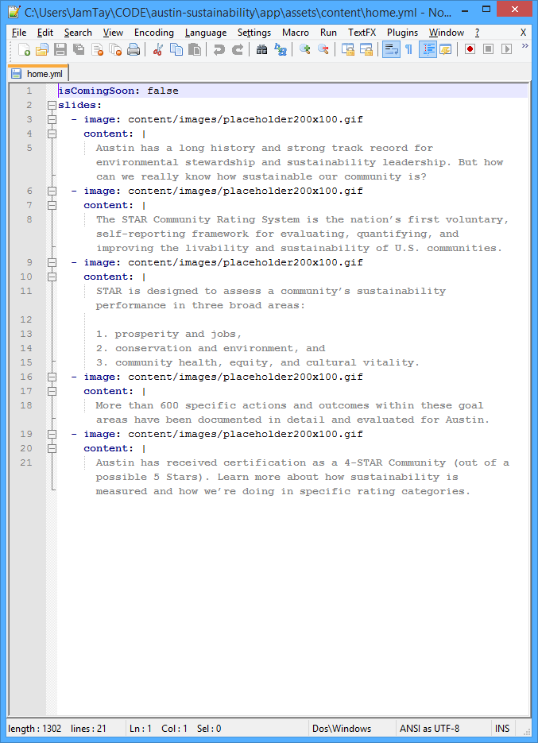

# Austin STAR Community <br/> Application & Site Guide

## Managing Content

### Introduction

There are eight special files from which the Austin STAR Community application gets its content. These files are located in the `_public/content/` folder.


The eight files are

* `home.yml` - Content for the Home page
* `arts_education_and_culture.yml` - Content for the Arts, Education, and Culture section
* `built_environment.yml` - Content for the Built Environment section
* `climate_and_energy.yml` - Content for the Climate and Energy section
* `economy_and_jobs.yml` - Content for the Economy and Jobs section
* `equity_and_empowerment.yml` - Content for the Equity and Empowerment section
* `health_and_safety.yml` - Content for the Health and Safety section
* `natural_systems.yml` - Content for the Natural Systems section

The content files use a text-based file format called "YAML". You can edit the content files in any text-editor, though an advanced editor such as Notepad++ (freely available at [http://notepad-plus-plus.org/](http://notepad-plus-plus.org/)), is suggested because they typically provide convenient syntax highlighting.

### YAML Basics

Documentation for YAML can be found at [http://www.yaml.org/](http://www.yaml.org/) though a deep understanding is not required for modifying the application's content.

For the YAML content files for this application there are only two basic terms to understand: *properties* and *lists*.

#### Properties

A *property* is indicated by its name, followed by a colon (`:`), and then its value. 

Example: `title: Climate and Energy`. 

In this example, "title" is the name of the property, and "Climate and Energy" is the value.

#### Lists

A *list* is a special value that contains multiple items, which can each have multiple properties. A *list* is indicated by a dash (`-`) symbol.

Example:

```
slides:
  - image: content/images/placeholder200x100.gif
    content: |
      Austin has a long history and strong track record for environmental stewardship and sustainability leadership. But how can we really know how sustainable our community is?
  - image: content/images/placeholder200x100.gif
    content: |
      The STAR Community Rating System is the nation’s first voluntary, self-reporting framework for evaluating, quantifying, and improving the livability and sustainability of U.S. communities.
```

In this example, the "slides" property has a list as its value. Each item in the list has a property named "image" and a property named "content".

### Markdown

Some of the property values in the YAML content files of this application are in a special language called *Markdown*.

### Home Page Content

 

The home page content file, `home.yml`, is where the content for the "slides" on the application's home page is defined.

This content is stored in a YAML list called `slides` as shown in the image below. Each item in the `slides` list has an `image` property and a `content` property.



### Section Content

All of the seven content section pages follow the same general format.

